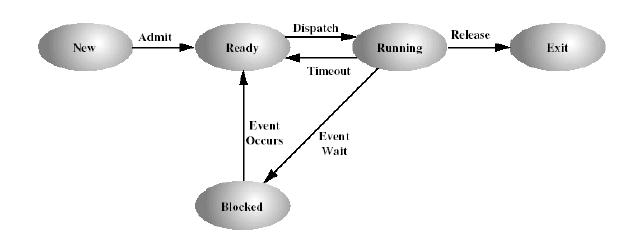
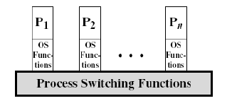
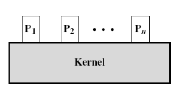
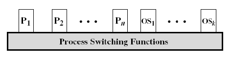

# 3장 Processes (프로세스)
##  ※ 프로세스란 무엇인가?
- instance of a running program으로, 실행중인 프로그램이라고 한다.
- 프로세스는 이미지와 프로세스 컨택스트로 분류된다.
   

###  ※ 이미지(image)는

- code segment: read only (instruction 코드)
- initialized data segment
- uninitialized data segment: 프로그램 시작 전엔 0으로 됨
- stack : 변수, 임시 변수, return 주소값, 등등
- heap : 동적 메모리

으로 구성되어 있다.
   

###  ※ PCB (process control block) & PD(process descriptor)
커널 데이터 구조에서 가장 essential한 부분: 
- 모든 프로세스에 존재하며
- pcb는 상기 서술했던 이미지와 프로세스 컨택스트로 구성되어 있다.
- 프로세스 컨텍스트는 프로그램 컨텍스트와 커널 컨택스트로 구성되어있다.
   

###  ※ Process State

- 프로세스는 New, Ready, Running, Blocked, Exit의 5가지 state를 위 그림의 형태로 존재
   

###  ※ 프로세스 스위칭
- 프로세스 스위칭이란 실행되고 있는 프로세스가 interrupt되고, 운영체제가 다른 프로세스를 running state로 바꿔주고 바꿔준 그 프로세스에게 권한을(컨트롤) 하게 해준다.

- ※ 그러면 궁금한점:
  - 프로세스 스위치를 발생시키는 이벤트는 무엇인가?
  - 프로세스 스위칭과 모드 스위칭의 차이점은 무엇인가?
  - 운영체제는 무엇을 해야 프로세스 스위칭을 할 수 있는가?
   

###  ※ 듀얼 모드 operation?
- 대다수의 모던 processor은 2가지 다른 모드를 제공한다
- 유저 모드와 커널 모드
- 모드 스위칭 요구됨! (유저 <-> 커널)
- 유저 모드: less privileged mode, 유저 프로그램은 이 단계에서 실행됨
- 커널 모드: more privileged mode, 프로세서의 완벽한 컨트롤, 레지스터, 메모리에 대한 권한, 운영체제의 커널
   

###  ※ 모드 스위칭이 일어나려면.. 
  - 외부 인터럽트 (타이머, I/O 인터럽트)
  - 내부 트랩(exception; page fault, invalid operation)
  - 시스템 콜( io operation, file open, fork)  
  
※ 이러한 모드 스위칭 마다,
  - 현재 프로세서 상태를 저장(레지스터, 플래그)
  - 프로그램 카운터를 적절한 루틴 주소로 바꿈
  - 커널 모드로 변경해서 privileged instruction 수행

**※※※ 프로세스 스위칭은 모드 스위칭이 일어날 때 일어날 수도 있다 ※※※**
프로세스 스위칭 없는 모드 스위칭;
- 대부분의 운영체제에서는 interrupt, exception, system call이 꼭 프로세스 스위칭을 요구하지는 않는다.
- 그러나 프로세스 스위칭이 있으면 모드 스위칭이 있다.
   

###  ※ 프로세스 스위칭 단계:
- 프로그램 컨텍스트 저장(레지스터 등등)
- 현재 프로세스의 state update함. (running을 blocked, ready, exit로 변경)
- PCB를 적절한 queue로 이동
- 다른 프로세스를 실행시킴 (스케줄링 기법에 의해)
- PCB를 적절한 queue로 이동
- 골라진 process를 running으로 변경
- memory management 구조를 update한다
- 프로그램 context (새로운 프로세스의)을 복구시킨다

**프로세스 스위칭은 state 변경을 포함하며, 모드 스위칭보다 더 많은 것을 요구한다**
   

###  ※ 커널 모드 활성화;
- 프로세스는 시스템 콜을 유발한다
- 프로세스를 run 시키는 cpu는 exception을 signal 한다.
- 커널 스레드가 실행된다.
   

###  ※ 시스템 콜이란?
- 커널 서비스를 위해 있는 programming construct
- 유저 모드에서 커널 모드로 변경
   

###  ※ 운영체제 실행; -> Just like 소프트웨어
프로세서에 의해 실행 -> 제어권 포기, 복구위해
   

###  ※ 어떻게 os 컨트롤되나?
1. 유저 프로세스에 의해 실행
- 모든 os 코드는 유저 프로세스의 context에 의해 실행된다
-> 항상 프로세스 스위칭이 일어나는 것이 아니고, 그냥 모드 스위칭만 있을수도 있음(장점)

2. nonprocess kernel;
- 전통적인 접근
- 유저 프로세스는 os 위에 stacked됨 (subroutines같은 것)

3. 프로세스 기반 운영체제
- 커널 함수들을 분리된 시스템 프로세스로 implement

   

###  ※ 프로세스 생성(운영체제 관점)
- pid 생성
- 프로세스의 메모리 allocate
- pcb initialized
- 적절한 queue 확인
- 다른 data structure 생성

###  ※ 어플리케이션 레벨 프로세스 생성
- 프로세스 계층 (부모 프로세스는 자식 프로세스 생성, 트리마냥)
- 주소 공간(자식은 부모를 복제한 것)
- 실행(부모는 자식 실행 완료할때까지 대기)
- 자원 공유(부모와 자식은 모든 자원을 공유한다/ 혹은 일부를 공유/ 혹은 공유 안함)
   

###  ※ UNIX 프로세스 syscall
- fork() == 자식 생성 
- exec() == 새로운 프로그램 실행을 initiate
- exit()  == 종료
- wait() == 부모가 자식 terminate 기다림
   
   

## **예상 질문**
 **Q1 . 프로세스 스위칭과 모드 스위칭의 차이를 간단히 설명하면?** 

  - 프로세스 스위칭은 현재 run하고 있는 프로세스의 state를 변경하고 스케쥴링에 따른 새로운 프로세스가 run하도록 state를 변경하게 하는 것이므로 완전 context switching이 필요하다.
  - 모드 스위칭은 유저 모드에서 커널 모드로 변경을 하며 완전 context switching이 필요하지 않다. 모드 스위칭은 외부 인터럽트, 내부 트랩, 시스템콜이 일어날 경우 일어난다. 커널 모드를 수행함에 따라 특정 권한의 명령 수행 가능